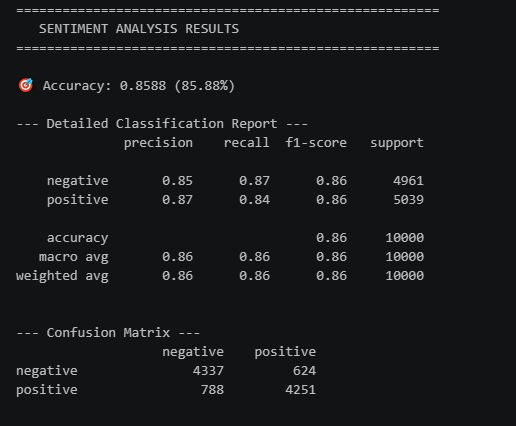

# IMDB Movie Review Sentiment Analysis

Sentiment analysis on IMDB movie reviews using Bag of Words and Naive Bayes, classifying reviews as positive or negative.

## What this covers

- Loading the IMDB reviews dataset
- Exploratory Data Analysis (data.head, data.info, value_counts on sentiment column)
- Text preprocessing (lowercase, tokenization, stopword removal, lemmatization)
- Train-test split (80-20)
- Feature extraction using CountVectorizer (Bag of Words)
- Training a Multinomial Naive Bayes model
- Predicting sentiment on test data and comparing with actual labels
- Model evaluation using accuracy score and confusion matrix
- Taking live user input and predicting sentiment on it

## Key challenges

Initially, I did the CountVectorizer (Bag of Words) step before splitting the data into train and test sets. My instructor pointed out that this is not the right order, vectorization should happen after the train-test split, not before. Doing it before the split can leak information between training and testing data, which affects how reliable the accuracy actually is.

I also missed doing lemmatization before the train-test split the first time around. I had to go back, fix the order of preprocessing steps, and rerun everything: lowercase conversion, stopword removal, lemmatization, then train-test split, then vectorization.

This was a good lesson in understanding why the order of steps in a machine learning pipeline matters, not just what each step does individually.

One clear issue I found: the model struggles with short reviews. For example, the input:

"This movie is really good and felt good."was predicted as negative, even though it's clearly a positive review. Since Bag of Words only looks at word counts and not context or word order, short reviews don't give the model enough pattern to work with. Longer, more detailed reviews get classified correctly.

## Tools used

- Python
- pandas
- NLTK (tokenization, stopwords, lemmatization)
- scikit-learn (CountVectorizer, train_test_split, MultinomialNB, accuracy_score, confusion_matrix)
- VS Code

## Output preview

Model accuracy: 85.88%

### Sample predictions

**Positive reviews correctly classified:**
1. "This movie was absolutely amazing, the acting was excellent and the story was very interesting."
2. "I loved this film, the characters were great and it kept me entertained from beginning to end."
3. "A fantastic movie with wonderful performances and a beautiful storyline."
4. "This was one of the best movies I have watched, everything about it was impressive."

**Negative reviews correctly classified:**
1. "This movie was terrible, the story was boring and the acting was disappointing."
2. "I hated this film, it was a complete waste of time with poor acting and a bad storyline."

**Misclassified example (too short):**
- "This movie is really good and felt good" was predicted as negative

## What I learned

- How to preprocess raw text for a machine learning model (lowercase, tokenize, remove stopwords, lemmatize)
- How Bag of Words converts text into numerical features a model can use
- How Naive Bayes works for text classification
- The limitation of Bag of Words with short text, since it ignores word order and context
- Why longer, detailed input gives more reliable predictions

## Dataset source

Sourced from a public dataset (IMDB movie reviews).
