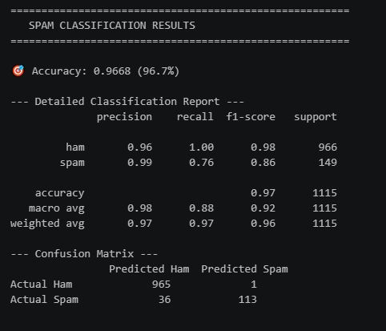
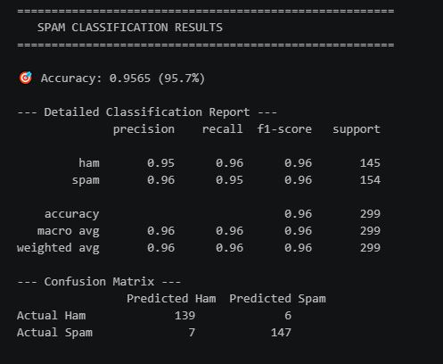
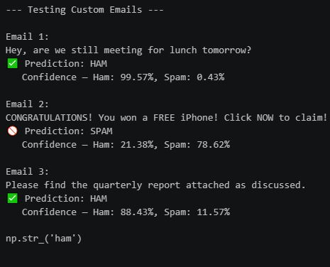
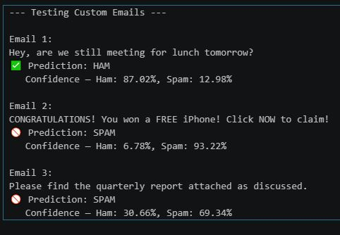

# Spam vs Ham Classification

Text classification to detect spam vs ham (legitimate) messages, comparing two approaches since the dataset was imbalanced: one without handling the imbalance, one with undersampling.

## What this covers

- Loading and exploring the spam/ham dataset
- Checking class distribution (4825 ham, 747 spam, roughly 6.5:1 imbalance)
- Text preprocessing using a single function (tokenize, stopword removal, stemming/lemmatization) applied to the Message column
- Train-test split, then feature extraction using TfidfVectorizer (applied after the split)
- Model training using Multinomial Naive Bayes
- Approach 1: without handling class imbalance
- Approach 2: with undersampling the majority class
- Comparing results between both approaches using precision, recall, and F1-score, not just accuracy

## Key challenges

The first thing I got stuck on was deciding whether to go with the imbalanced dataset as it was, or fix it with undersampling. I wanted to actually compare both instead of picking one, so I built both versions.

On the imbalanced data, the model scored 97.6% accuracy, but this number was misleading. A model that always predicted "ham" would already score 86.6% accuracy without learning anything. Looking at the classification report more closely, spam precision was a perfect 1.00, but spam recall was only 82%, meaning 27 out of 149 actual spam messages were missed and classified as ham.

After undersampling the majority class to balance ham and spam, accuracy actually dropped to 96.3%. At first this looked like the model got worse, but it didn't. The test set became balanced, so the model no longer had an easy majority-class advantage. Spam recall improved to 97%, catching 149 out of 154 actual spam messages, and the spam F1-score improved from 0.90 to 0.96.

Key takeaway: accuracy alone is not a reliable metric on imbalanced datasets. A drop in accuracy after undersampling does not mean the model got worse, it means the evaluation became fairer. In this case, the trade-off actually improved the model's ability to correctly catch spam, which is the more important goal in a spam detection system.

The second challenge was a preprocessing error. I wrote all my preprocessing steps (tokenize, stopwords, stemmer) inside a single function, then called it like this:

`preprocess_text(new_dataset["Message"])`

This threw an error. I learned that `new_dataset["Message"]` is a Series, not a single string, and `word_tokenize()` cannot tokenize an entire Series directly. I fixed it by applying the function to each row instead:

`new_dataset["processed_message"] = new_dataset["Message"].apply(preprocess_text)`

This ensures the preprocessing function runs on each individual message in the column, not the column as a whole.

The third issue was a small but important mistake, I unknowingly used `fit_transform` on my test data as well. Only the training data should be fit, the test data should only be transformed using what was already fit on the training data. Fitting on test data leaks information and gives an unrealistically optimistic result. I used `TfidfVectorizer`, applied after the train-test split, with `MultinomialNB` as the model.

One more interesting observation while testing with my own custom input. I passed the message:

"Please find the quarterly report attached as discussed."

which is clearly a ham message. The model trained without undersampling correctly predicted it as ham, likely because it had seen a much larger volume of ham messages during training. But the model trained with undersampling predicted it as spam. This was a useful reminder that undersampling, while it improved spam recall on the test set, also means the model saw far fewer ham examples overall, which can make it slightly less reliable at recognizing certain ham messages it wasn't exposed to enough. It shows there's a real trade-off between the two approaches, not a simple "one is better" conclusion.

## Tools used

- Python
- pandas
- NLTK
- scikit-learn (TfidfVectorizer, MultinomialNB, train_test_split)
- VS Code

## Files in this folder

- `NLP_email_ham_vs_Spam_without_undersampling.ipynb`
- `NLP_email_ham_vs_Spam_undersampling.ipynb`

## Results comparison

| Approach | Accuracy | Spam Precision | Spam Recall | Spam F1-score |
|---|---|---|---|---|
| Without undersampling | 97.6% | 1.00 | 82% | 0.90 |
| With undersampling | 96.3% | - | 97% | 0.96 |

## Output preview

### Accuracy report and confusion matrix

| Without Undersampling | With Undersampling |
|---|---|
|  |  |

### Custom test email prediction

**Without undersampling** (correctly predicted as ham):

**With undersampling** (incorrectly predicted as spam):

This shows the trade-off discussed above, undersampling improved spam recall overall, but reduced exposure to ham examples, which affected this specific prediction.

## What I learned

- Why accuracy alone can be misleading on imbalanced datasets
- How to read and compare precision, recall, and F1-score per class
- Why undersampling can lower accuracy while actually improving the model's real-world usefulness for the minority class
- That undersampling has a trade-off too, reducing majority-class examples can affect how well the model handles certain majority-class cases, as seen with the misclassified ham example
- How to correctly apply a preprocessing function across an entire pandas column using `.apply()`, instead of passing the whole Series directly
- The difference between `fit_transform` and `transform`, and why fitting must only happen on training data, never on test data
- How to use TfidfVectorizer correctly, applying it after the train-test split

## Note

This is a hands-on practice exercise, not a deployed project. I haven't learned deployment yet, that's planned for later in my course. The focus here was on building the pipeline correctly and understanding evaluation metrics, not on shipping a live application.

## Dataset source

Sourced from a public dataset (SMS Spam Collection).
