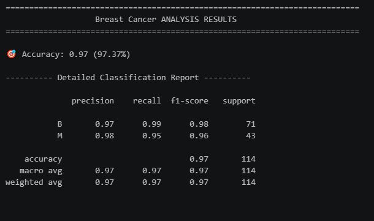
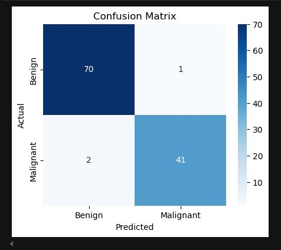

# Breast Cancer Prediction (Logistic Regression)

Classifying tumors as malignant or benign using Logistic Regression on diagnostic features.

## What this covers

- Loading the breast cancer dataset
- Exploratory Data Analysis (head, shape, isnull().sum(), info, describe, checking value_counts on the diagnosis column to see if the target is balanced, visualized using matplotlib and seaborn)
- Dropping the id column, since it carries no predictive value
- Selecting features (x) and target (y)
- Train-test split (80-20)
- Standardizing numeric features using StandardScaler, fitting only on training data and transforming both train and test separately
- Training a Logistic Regression model
- Predicting on test data and evaluating using accuracy, classification report, and confusion matrix
- Taking custom user input to predict whether a case is cancerous or non cancerous

## Key challenges

This exercise went smoothly without any major technical struggles, since the preprocessing pattern (train-test split, then fit_transform on train and transform on test) was already familiar from earlier projects.

That said, the most important part of this project wasn't a coding difficulty but interpreting what the confusion matrix actually means in a medical context. Out of 71 actual non cancerous (benign) cases, the model correctly predicted 70 as non cancerous, and incorrectly predicted 1 as cancerous (a false positive). This creates unnecessary panic and fear for someone who is actually cancer free, which matters, but is a relatively lower-stakes kind of error.

Out of 43 actual cancerous cases, the model correctly predicted 41 as cancerous, but incorrectly predicted 2 as non cancerous (a false negative). This is the more serious error, since it means 2 people who actually have cancer would be told they don't, potentially delaying real treatment. In a medical diagnosis context, false negatives carry far more risk than false positives, even though the overall accuracy score alone wouldn't reveal this distinction.

This was a useful reminder that in sensitive domains like healthcare, accuracy alone isn't enough to judge a model, understanding which type of error the model makes, and what real-world consequence that error carries, matters just as much as the overall performance number.

## Results

- Accuracy: 97.37%
- Precision, Recall, F1-score: see attached classification report image
- Confusion matrix: see attached image below

## Tools used

- Python
- pandas
- numpy
- matplotlib
- seaborn
- scikit-learn (StandardScaler, train_test_split, LogisticRegression, accuracy_score, classification_report, confusion_matrix)
- Visual Studio Code

## Files in this folder

- Selva_Logistic_Reggresion_CancerData.ipynb

## Output preview

### Accuracy and classification report

### Confusion matrix

## What I learned

- How to correctly apply StandardScaler, fitting only on training data and transforming both train and test separately, to avoid data leakage
- How to read a confusion matrix in terms of true positives, true negatives, false positives, and false negatives
- Why false negatives and false positives don't carry equal weight in every context, especially in medical diagnosis, where a false negative (missing an actual cancer case) is a far more serious error than a false positive
- Why accuracy alone isn't sufficient to judge a model in sensitive real-world applications, and why looking at the confusion matrix in context matters

## Note

This is a hands-on practice exercise, not a deployed project.

## Dataset source

Sourced from a public dataset (breast_cancer_data.csv).
