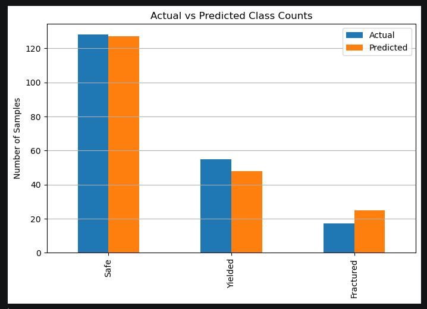
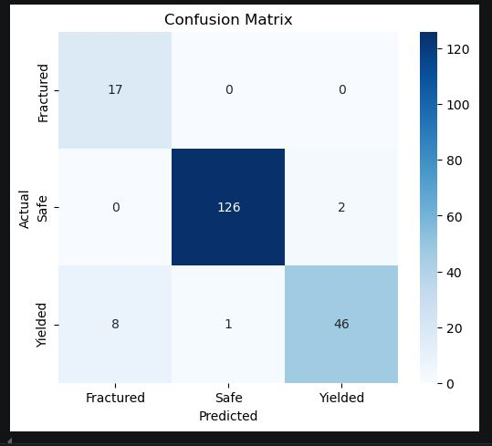
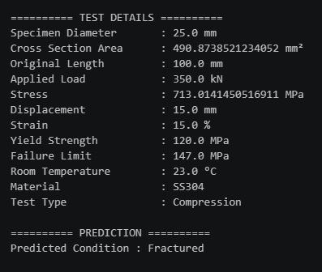

# Material Condition Classification: UTM Tensile/Compression Test (Logistic Regression)

Classifying Universal Testing Machine (UTM) test results into Safe, Yielded, or Fractured categories using Logistic Regression, based on a synthetic dataset built to reflect real tensile and compression testing.

## What this covers

- Loading the dataset from an Excel file with multiple sheets, reading the specific sheet using sheet_name
- Exploratory Data Analysis (head, shape, isnull().sum(), info, describe, duplicated().sum(), checking value_counts on the Condition column to check class balance, visualized using matplotlib and seaborn)
- Checking the distribution of stress values across the dataset
- Carefully selecting features and target to avoid data leakage (explained in Key challenges)
- One hot encoding categorical columns (Material, Test_Type), dropping the first column of each to avoid redundant columns
- Train-test split (80-20)
- Standardizing numeric features using `StandardScaler`, fitting only on training data and transforming both train and test separately
- Training a Logistic Regression model `LogisticRegression()`, first without handling class imbalance, then again using `class_weight='balanced'`
- Evaluating using accuracy, classification report, and confusion matrix for both versions
- Taking custom user input to predict the condition of a new test sample

## Key challenges

This dataset is something I built myself, synthetically, based on an actual Universal Testing Machine tensile and compression experiment I performed during my second year of Mechanical Engineering in 2014. Back then, we loaded a specimen manually and recorded readings by hand as a batch. Revisiting that same kind of experiment here, this time modeling it computationally, made this exercise feel different from the other practice datasets, since this one genuinely connects to my own academic and engineering background.

The first real challenge was avoiding data leakage before it happened, rather than discovering it afterward like in my earlier taxi fare project. I made sure to drop Yielded_Flag and Fractured_Flag from my features, since these are essentially the final results that directly determine the target. I also deliberately avoided using Yield_Strength_MPa and Failure_Limit_MPa as features, since these are fixed reference values, if stress exceeds these thresholds, the material is already yielded or fractured by definition, so including them would let the model cheat by comparing thresholds rather than learning real patterns.

The second challenge came after training my first model without checking for class imbalance. The initial results looked good on the surface, 92% accuracy, but looking closer at the classification report showed a serious problem with the Fractured class: precision was 1.00, but recall was only 0.18. This meant that whenever the model predicted "Fractured," it was right 100% of the time, but it only caught 18% of actual fracture cases, missing 14 out of 17 real fractures, which got mislabeled as "Yielded" instead.

Going back to check my EDA, I found the class distribution was Safe: 629, Yielded: 308, Fractured: 63, confirming Fractured was the genuinely underrepresented class.

Having already tried undersampling in an earlier project, I wanted to try a different approach this time, using `class_weight='balanced'` in the Logistic Regression model itself. This makes mistakes on the minority class (Fractured) count for more during training, so the model can no longer get a good accuracy score just by ignoring the rare class.

After applying `class_weight='balanced'`, Fractured recall improved to 1.00, catching all 17 actual fracture cases, though precision dropped to 0.68, meaning some false alarms were introduced. For a structural failure detection use case like this, missing an actual fracture (a false negative) is far more dangerous than raising a false alarm (a false positive), since a missed fracture could mean a genuinely unsafe material is marked safe. This makes the balanced model the better and more responsible choice, despite the drop in precision.

A third mistake, made purely out of excitement while building the user input section, was initially asking the user to directly enter Cross_Sectional_Area_mm2, Stress_MPa, and Strain_Percent as raw inputs. These aren't independent measurements, they're calculated values derived from other, more basic inputs:

```python
Cross_Sectional_Area_mm2 = np.pi * (Specimen_Diameter_mm / 2) ** 2
Stress_MPa = (Applied_Load_kN * 1000) / Cross_Sectional_Area_mm2
Strain_Percent = (Displacement_mm / Original_Length_mm) * 100
```

Asking the user to type these values in directly defeats the purpose of a prediction tool, since the user would essentially need to already know the answer-adjacent values themselves. I fixed this by removing those as direct inputs and instead calculating Cross_Sectional_Area_mm2, Stress_MPa, and Strain_Percent internally from the actual raw inputs a user would realistically have, specimen diameter, applied load, displacement, and original length, keeping the prediction genuinely useful from real-world measurable inputs.

## Results comparison

<table>
<tr>
<th>Without Balancing</th>
<th>With class_weight='balanced'</th>
</tr>
<tr>
<td>

| Class | Precision | Recall | F1-score |
|---|---|---|---|
| Fractured | 1.00 | 0.18 | 0.30 |
| Safe | 0.97 | 1.00 | 0.98 |
| Yielded | 0.82 | 0.96 | 0.88 |

</td>
<td>

| Class | Precision | Recall | F1-score |
|---|---|---|---|
| Fractured | 0.68 | 1.00 | 0.81 |
| Safe | 0.99 | 0.98 | 0.99 |
| Yielded | 0.96 | 0.84 | 0.89 |

</td>
</tr>
</table>

Accuracy: 92.00% (without balancing) vs 94.50% (with class_weight='balanced')

**Key takeaway:** Without balancing, the model rarely predicted the minority class (Fractured), missing 14 out of 17 real fracture cases (recall 0.18) despite being accurate whenever it did predict Fractured (precision 1.00). Applying class_weight='balanced' forced the model to take the minority class seriously, catching all 17 fracture cases (recall 1.00) at the cost of some false alarms (precision 0.68). For a structural failure detection use case, missing a real fracture (false negative) is more costly than a false alarm (false positive), making the balanced model the better choice despite the precision trade-off.

## Tools used

- Python
- pandas
- numpy
- matplotlib
- seaborn
- scikit-learn (StandardScaler, train_test_split, LogisticRegression, accuracy_score, classification_report, confusion_matrix)
- Visual Studio Code

## Files in this folder

- Selva_Logistic_Regression_UTMData.ipynb

## Output preview

### Actual vs Predicted



### Confusion matrix



### Custom sample prediction



## What I learned

- How to think about data leakage before training, not just catch it afterward, by carefully reasoning about which columns are outcomes or fixed thresholds rather than genuine predictive features
- How to identify class imbalance by checking value_counts on the target column, not just trusting an overall accuracy score
- Why precision and recall can tell very different stories for the same class, and why a high precision with low recall on a rare but critical class is a serious warning sign, not a good result
- How to use class_weight='balanced' as an alternative to undersampling, forcing the model to take a minority class seriously without discarding majority class data
- Why, in a safety-critical use case like structural failure detection, recall on the critical class matters more than overall accuracy or precision, since a missed fracture is more dangerous than a false alarm
- The difference between a raw, independently measurable input and a derived or calculated value, and why a prediction tool should only ask users for genuinely independent inputs, calculating any derived values internally rather than asking the user to provide them directly

## Note

This is a hands-on practice exercise, not a deployed project.

## Dataset source

Synthetic dataset generated for personal practice purposes, based on the structure of a real Universal Testing Machine tensile and compression test.
