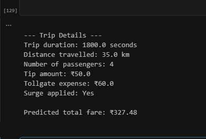

# Taxi Fare Prediction (Linear Regression)

Predicting total taxi fare using Linear Regression, based on trip details like duration, distance, passengers, and surge pricing.

## What this covers

- Loading and exploring the taxi fare dataset (sourced from Kaggle)
- Exploratory Data Analysis (data.head, shape, describe, info, checking for null values)
- Checking and removing duplicate rows (over 4000 duplicate rows found and removed using drop_duplicates)
- Visualizing correlation between features using a heatmap (matplotlib and seaborn)
- Selecting features and target, and correcting a data leakage mistake found along the way (explained in Key challenges)
- Train-test split (80-20)
- Standardizing features using StandardScaler
- Training a Linear Regression model
- Predicting on test data and evaluating using MAE, MSE, RMSE, and R2 Score
- Plotting actual vs predicted fare for a random sample of 100 test rows
- Taking custom user input and predicting the fare for a new trip

## Key challenges

The biggest challenge in this project was a data leakage mistake I didn't catch right away. I initially chose my features (x) as trip_duration, distance_traveled, num_of_passengers, fare, tip, miscellaneous_fees, and surge_applied, with total_fare as the target (y). After training, my R2 Score came out as 100%, with MAE, MSE, and RMSE all extremely close to zero.

The number looked correct, but something felt wrong about a perfect score. I looked into it and realized the issue: total_fare is literally the sum of fare, tip, and miscellaneous_fees. By including those columns as features while predicting total_fare, the model wasn't learning any real pattern, it was just learning basic addition. This is a classic data leakage problem, where a feature directly contains or reveals the answer to the target.

To fix it, I removed fare from the features, since it was the biggest contributor to total_fare. I initially kept tip and miscellaneous_fees since they contribute a much smaller part of the total. After this fix, R2 Score dropped to 39.33%, which is a far more realistic and honest number, but it also confirmed the leakage was the reason behind the earlier perfect score.

Here is a comparison of what happened across the different feature combinations I tried:

| # | Features in x | Target | MAE | MSE | RMSE | R2 |
|---|---|---|---|---|---|---|
| 1 | trip_duration, distance_traveled, num_of_passengers, surge_applied, fare, tip, miscellaneous_fees (full leakage) | total_fare | 1.37e-13 | 5.65e-26 | 2.38e-13 | 100.00% |
| 2 | trip_duration, distance_traveled, num_of_passengers, surge_applied (clean, no leakage) | total_fare | 60.60 | 8911.48 | 94.40 | 1.87% |
| 3 | trip_duration, distance_traveled, num_of_passengers, surge_applied, tip, miscellaneous_fees (partial leakage) | total_fare | 43.99 | 5509.15 | 74.22 | 39.33% |

This comparison itself became one of the most useful things I learned from this project, seeing how much a single leaked feature can distort results, and how removing leakage entirely (row 2) shows the trip details alone barely explain fare variation, meaning distance and duration alone aren't strong predictors of the final fare in this dataset.

Another new thing I learned this time was using a heatmap to visualize correlation. A heatmap is just a visual way to show a correlation matrix, a table of numbers showing how strongly each pair of columns moves together, with color intensity replacing the need to scan raw numbers manually.

One smaller but honest difficulty, I wrote this code without relying on Copilot's inline suggestions, typing everything manually, which led to a fair number of typos along the way.

## Results

Using the partial feature set (row 3 above, tip and miscellaneous_fees retained):

- MAE: 43.99
- MSE: 5509.15
- RMSE: 74.22
- R2 Score: 39.33%

## Tools used

- Python
- pandas
- numpy
- matplotlib
- seaborn
- scikit-learn (StandardScaler, train_test_split, LinearRegression, metrics)
- Visual Studio Code

## Files in this folder

- Selva_Linear_Regression_TaxiFare.ipynb

## Output preview

### Actual vs Predicted Fare

This chart compares the model's predicted total fare against the actual value for 100 randomly selected test samples. The predicted line follows the general shape of the actual data and picks up on some pattern, but it doesn't track the peaks and dips precisely, especially for the highest fare trips. This matches the R2 score, which shows the model explains only part of the variation in fare, and suggests the current features aren't enough to capture what drives extreme fares specifically.

y_pred.JPG)

### Custom fare prediction

## What I learned

- What data leakage is, and how including a feature that directly contributes to the target (like fare being part of total_fare) can produce misleadingly perfect results
- Why a perfect or near perfect R2 Score should raise suspicion rather than be taken as a good result
- How to use a heatmap to visualize correlations between features quickly, instead of scanning a raw correlation matrix
- How to detect and remove duplicate rows using duplicated() and drop_duplicates()
- That having more features doesn't automatically mean better predictions, since even after removing leakage, trip duration, distance, passengers, and surge alone only weakly explain fare variation

## Note

This is a hands-on practice exercise, not a deployed project.

## Dataset source

Sourced from a public dataset on Kaggle (Taxi Fare data).
