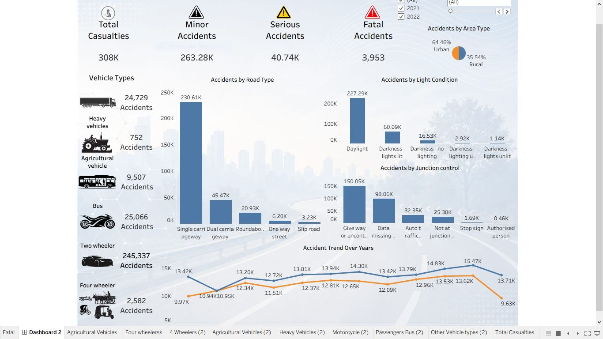

# Road Accident Analysis Dashboard

Interactive Tableau dashboard exploring accident trends, road conditions, vehicle 
categories, and environmental factors influencing road accidents.

## What this covers
- Accident Count vs Accident Severity, Road Type, Light Condition, and Junction Control
- Urban vs Rural accident distribution
- Monthly trend analysis comparing 2021 vs 2022 accident counts
- Total Casualties KPI
- Vehicle category analysis with grouped types and custom icons

## Design choices

**1. Vehicle category grouping**
Grouped similar vehicle types into meaningful categories (4-wheelers, heavy vehicles, 
2-wheelers, buses, agricultural vehicles, etc.) instead of leaving raw vehicle types 
ungrouped, to make the analysis easier to read and compare.

**2. Custom icons and global filters**
Added custom vehicle symbols/icons from an external source for visual clarity, and 
applied global filters across all sheets so the dashboard stays interactive and 
consistent across every view.

## Key insights
- Most accidents occurred under the 4-wheeler category
- Urban areas recorded significantly more accidents than rural areas
- Accident counts peaked in November (likely holiday travel), dipped in December, 
and surged again in January (likely return travel)
- Most accidents occurred during daylight conditions
- Single carriageways recorded the highest accident frequency
- A large number of accidents occurred near uncontrolled or give-way junction controls

## Tools
Tableau, OBS Studio (dashboard walkthrough recording)

## Dashboard preview

## Video walkthrough
🎥 [Watch dashboard walkthrough](https://github.com/user-attachments/assets/58bb214e-cb6a-47c0-93e4-9a469975e91c)

## What I learned
- Building interactive dashboards in Tableau
- Applying filters across multiple sheets
- Creating different chart types for analysis
- Dashboard layout and visual customization
- Using custom icons and background themes
- Understanding accident trends through data visualization
- Data storytelling

## Dataset
Road accident data (2021-2022), sourced from a public dataset.
