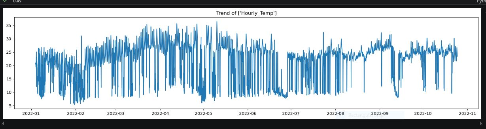
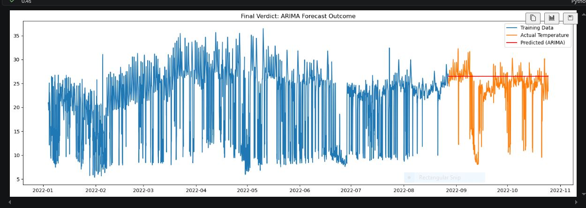

# Weather Temperature Forecasting (ARIMA)

Forecasting hourly temperature readings using ARIMA, a time series forecasting model, different in approach from the supervised learning models used in earlier exercises.

## What this covers

- Loading the weather dataset (hourly temperature readings) using pd.read_csv
- Exploratory Data Analysis (head, dropping unwanted columns, shape, isnull().sum(), info)
- Converting the Datetime column from string (object) format to proper datetime format using pd.to_datetime
- Visualizing temperature distribution across months
- Splitting the series into train (past) and test (future) based on time order, not a random 80-20 split
- Training an ARIMA model and forecasting on the test period
- Evaluating using MAE, RMSE, and MAPE
- Taking custom user input to forecast temperature for a future period, on an hourly, daily, or weekly basis

## Key challenges

This project used a fundamentally different approach compared to my earlier supervised learning exercises, and understanding that difference was itself the first challenge. In models like Linear Regression or Logistic Regression, you select separate feature columns (x) and a target column (y), then split rows randomly into train and test. In time series forecasting, there's only one series, the sequence of temperature readings itself. You split it by time instead, an earlier chunk becomes train, and a later chunk becomes test, since the forecast is based purely on the series' own past values and order, not on any external features.

Understanding the ARIMA order parameter (p, d, q) was another key part of this project:
- p (AR term) is the number of past values used to predict the current value. p=1 means today's value is modeled using yesterday's value.
- d (differencing term) is how many times the series is differenced to remove trend and make it stationary. ARIMA assumes the series has a constant mean and variance over time, and raw temperature data usually trends or drifts, so differencing once (d=1) often removes that trend.
- q (MA term) is the number of past forecast errors used to correct the current prediction. q=1 means the model looks at how wrong it was one step back and adjusts accordingly.

Forecasting itself works differently too. Instead of calling predict() on new feature rows, ARIMA forecasts by position in the timeline using start and end indexes matching exactly where the test set falls. I used typ='levels' in the prediction call, since the model was trained on differenced data (d=1), without this, the output would come back in differenced form instead of actual usable values.

The most significant challenge was a bug in my custom user input section. At first, predictions for future temperatures looked correct, but I later realized the forecast was actually starting from the end of the training set, not the end of the full dataset. So if a user asked for the next 5 hours, the model was forecasting the 5 hours right after training ended, not 5 hours from the actual latest available data point. I fixed this by refitting the model on the entire dataset (not just the training portion) specifically for the user input section, ensuring forecasts genuinely start from the true end of the available data.

To make the user input section more useful, I added conditional logic (if statements) so the user can choose whether to forecast on an hourly, daily, or weekly basis.

## Results

- MAE: 5.37
- RMSE: 3.15
- MAPE: 21.20%

## Tools used

- Python
- pandas
- numpy
- matplotlib
- statsmodels (ARIMA)
- Visual Studio Code

## Files in this folder

- SELVA_WEATHER_ARIMA_TEMP.ipynb

## Output preview

### Temperature distribution over time

### Actual vs Forecasted

## What I learned

- The difference between a supervised learning train-test split (random, feature-based) and a time series train-test split (sequential, based purely on time order)
- What the ARIMA (p, d, q) parameters represent, and why differencing (d) is used to make a trending series stationary before modeling
- Why typ='levels' is required when forecasting from a differenced model, to get results back in actual, interpretable units
- That a time series model needs to be refit on the complete dataset before making real future predictions, forecasting from a model still fit only on the training set gives forecasts anchored to the wrong point in time
- What MAPE (Mean Absolute Percentage Error) measures, and how it complements MAE and RMSE by expressing error as a percentage rather than an absolute value

## Note

This is a hands-on practice exercise, not a deployed project.

## Dataset source

Sourced from a public dataset (hourly weather temperature readings).
